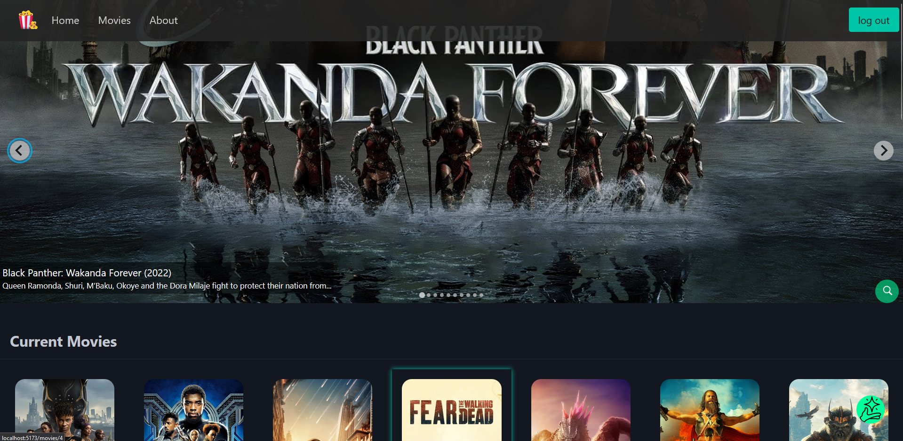
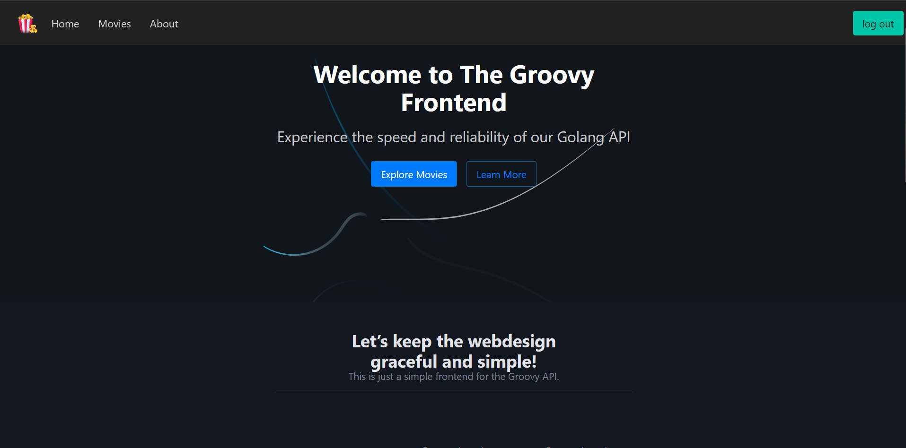

<p align="center">
  <a href="" rel="noopener">
 </a>
</p>

<h3 align="center">groovy-frontend</h3>

<div align="center">

[]()
[](https://github.com/Blue-Davinci/Groovy-Frontend/issues)
[](https://github.com/Blue-Davinci/Groovy-Frontend/pulls)
[](/LICENSE)

</div>

---

<p align="center"> Few lines describing your project.
    <br> 
</p>

## 📝 Table of Contents

- [About The Project](#about)
- [Getting Started](#getting_started)
- [Prerequisites](#prerequisites )
- [Deployment](#deployment)
- [Sample Output](#SampleOutput)
- [Usage](#usage)
- [Built Using](#built_using)
- [TODO](./TODO.md)
- [Contributing](../CONTRIBUTING.md)
- [Authors](#authors)
- [Acknowledgments](#acknowledgement)

## 🧐 About <a name = "about"></a>

The Groovy Frontend project is a companion to the [Groovy API](https://github.com/Blue-Davinci/groovy), a robust movie data service built with Golang. This frontend, built with Svelte, serves as the user interface for the Groovy API, providing an intuitive and engaging platform for users to interact with a vast array of movie data. It leverages the capabilities of the Groovy API to present movie information in a user-friendly format, enhancing the overall user experience.

The project supports essential user authentication features, including login and signup via bearer tokens. Once authenticated, users can perform a variety of activities such as creating, viewing, updating, and deleting movies. The system is designed with a custom permissions framework, ensuring that only authorized users can perform write operations, while read operations are available to all users. This approach ensures a secure and controlled environment, maintaining the integrity of the movie data while providing a dynamic and interactive platform for movie enthusiasts.



## 🏁 Getting Started <a name = "getting_started"></a>

These instructions will get you a copy of the project up and running on your local machine for development and testing purposes. See [deployment](#deployment) for notes on how to deploy the project on a live system.

📝 **A Quick Note**
- The project uses the `server.js` routing method. All communication with the GROOVY API is made via `route\api\server.js`
- The signup & login pages utilize `page.server.js` as `server.js` proxies using page actions to route the form data.
- Custom error.html and a single error.svelte are used to render custom error messages and as fallbacks to `fail()`

### Prerequisites <a name="prerequisites "></a>

Before you can run the Groovy Frontend project, you need to ensure that you have the following prerequisites installed on your system:

- Node.js: This project is built with Svelte, which requires Node.js to run. You can download Node.js from the official website.

- Visual Studio Code: This is the recommended code editor for this project. You can download it from the official website.

- Svelte: This project is built with Svelte. You can install it globally on your system by running npm install -g svelte.

- Pico CSS: A simple CSS Library. I have used is as the essential foundation in addition to Custom CSS

- Groovy API Server. This can be found [here](https://github.com/Blue-Davinci/Groovy)


### Installing

Follow these steps to install and run the Groovy Frontend project:

1. Clone the Repository: First, you need to clone the repository to your local machine. You can do this with the following command:

Say what the step will be

```
git clone https://github.com/Blue-Davinci/Groovy-Frontend.git
```
2. Navigate to the Project Directory: Use the command line to navigate into the root directory of the project:
```
cd groovy-frontend
```
3. Install Node.js: If you haven't already, install Node.js. You can download it from the [official website](https://nodejs.org/).

4. Install Svelte: Install Svelte globally on your system by running:
```
npm install -g svelte 
```
5. Install Project Dependencies: Install the project's dependencies by running:
```
npm install
```
6. Launch Groovy Server by following the instructions [here](https://github.com/Blue-Davinci/Groovy?tab=readme-ov-file#installing)

7. Make sure you create the following 2 files in the root folder i.e `Groovy-Frontend\`:
```
.env.development
VITE_API_BASE_URL = "http://localhost:4000/v1"
```

```
.env.production
VITE_API_BASE_URL = "http://host.docker.internal:4000/v1"
```

8. After a succesful setup+startup of the Grovy backend API - above- proceed and start the development server by running:
```
npm run dev
```
The Groovy Frontend should now be running on your local machine. You can access it by opening your web browser and navigating to http://localhost:5000 (or the port number displayed in your terminal).

## 🔧 Sample Output <a name = "SampleOutput"></a>
You can view the sample look & feel below:




## 🎈 Usage <a name="usage"></a>

The basics of the app includes:
1. Homepage: Navigate to http://localhost:5000 to view the homepage. Here, you'll find a collection of movies displayed.

2. User Registration and Login: If you're a new user, click on the 'Sign Up' button to create a new account. If you're a returning user, click on the 'Login' button and enter your credentials.

3. Movie Creation: After logging in, you can create a new movie by clicking on the 'Create Movie' button. Fill in the required details and click 'Submit'.

4. Viewing Movies: You can view the details of a movie by clicking on the movie's title or image from the homepage.

5. Updating and Deleting Movies: If you have the necessary permissions, you can update or delete a movie by navigating to the movie's detail page and clicking on the 'Update' or 'Delete' button.

6. Logout: When you're done, you can log out of your account by clicking on the 'Logout' button.

## 🚀 Deployment <a name = "deployment"></a>
## Docker
Dockerfile and Docker Compose Setup:

The application uses a multi-stage Dockerfile for building and running the application. The build stage uses a Node.js base image to install dependencies and build the application. The final stage prepares the runtime environment.
The `docker-compose.yml` file orchestrates the build and deployment process, ensuring the application is containerized and runs as expected.

To Build the application:
1. Navigate to project directory:
```
cd groovy-frontend
```
2. Check and verify the following file incase you want to change any configs:
```
docker-compose.yml
Dockerfile
```
3. Run the following command to build the docker image based on the `docker-compose.yml` file:
```
docker compose up --build
```
  - The --build option ensures that Docker Compose rebuilds the image, which is useful for incorporating the latest changes in the source code or dependencies.

## A note:
- The application uses different API connection strings based on the environment (development or production).
- The settings can be found in the `.env.development` and `.env.production` files. The prod strings involve connections to & from the docker container. You can replace this with your own connection strings.

## Netlify
- This app uses the `adapter-netlify` svelte adapter which is designed to deploy the app as netlify functions.

- To install the adapter:
```
npm install -D @sveltejs/adapter-netlify
```
- The app also has a pre-encluded `netlify.toml` for the build commands
- You can then  create your new project and add your site by following their official instructions [here](https://docs.netlify.com/welcome/add-new-site/)

## Sample Ouput after succesful deployment:
```
app-1  | 
app-1  | Please see https://github.com/sveltejs/vite-plugin-svelte/blob/main/docs/faq.md#missing-exports-condition for details.
app-1  |   ➜  Local:   http://localhost:4173/
app-1  |   ➜  Network: http://170.20.0.2:4173/
```
- Make sure to always have the backend `Groovy` running before running this frontend app.

## ⛏️ Built Using <a name = "built_using"></a>

- [Pico CSS](https://picocss.com/) - Minimal CSS Framework for semantic HTML
- [Node.js](https://nodejs.org/en/) - Server Environment
- [Svelte](https://svelte.dev/) - Innovative Framework for building user interfaces
- [SvelteKit](https://kit.svelte.dev/) - Framework for building web applications with Svelte
- [Zod](https://github.com/colinhacks/zod) - TypeScript-first schema validation with static type inference
- [Splide JS](https://splidejs.com/) - Lightweight, flexible and accessible slider/carousel solution
- [Svelte-Toast](https://zerodevx.github.io/svelte-toast/) - Toast notification library for Svelte
- [Icons8](https://icons8.com/) - Icons and UI design resources

## ✍️ Authors <a name = "authors"></a>

- [@Blue-Davinci](https://github.com/Blue-Davinci) - Idea & Initial work

## 🎉 Acknowledgements <a name = "acknowledgement"></a>

Hat tip to:
- [Official Svelte](https://learn.svelte.dev/tutorial/welcome-to-svelte)
- [Joy of Code](https://joyofcode.xyz/)
- [HuntaByte](https://www.youtube.com/@huntabyte)
- Any and all people whose libraries\codes were used.